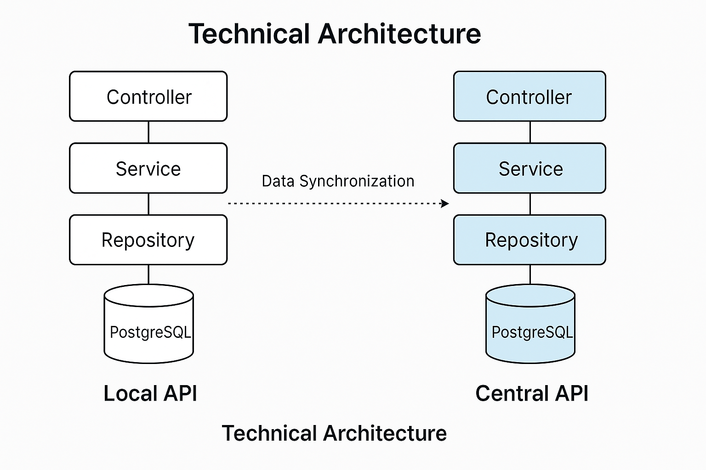

# Sale Point Restaurant - Système de gestion de restaurant

API REST backend développée avec Spring Boot pour gérer les ingrédients, les plats et les commandes d'un restaurant, avec gestion des stocks et des prix.

> Projet solo - développement complet de l'API locale.



---

## Stack technique

| Couche | Technologie |
|---|---|
| Framework | Spring Boot |
| Base de données | PostgreSQL |
| Contrat API | OpenAPI 3 |
| Tests | Postman |
| Architecture | Controller / Service / Repository / Mapper / Configuration |

---

## Fonctionnalités

- **Gestion des ingrédients** : CRUD complet avec filtres sur le prix et le stock, suivi des mouvements de stock
- **Gestion des plats** : création et composition (ingrédients requis par plat), modification, suppression
- **Gestion des commandes** : création, transitions de statut des plats (en attente → en préparation → servi)
- **Séparation stricte des responsabilités** : la logique métier ne touche jamais la couche HTTP
- **Gestion d'erreurs structurée** : codes 400, 404, 500 avec messages explicites
- **Contrat OpenAPI 3** utilisable comme référence de consommation pour tout client tiers

---

## Lancer le projet en local

### Prérequis

- Java 17+
- PostgreSQL 14+
- Maven

### Installation

```bash
git clone https://github.com/Williest-Andry/sale-point-restaurant.git
cd sale-point-restaurant
```

### Configuration

Dans `src/main/resources/application.properties` :

```properties
spring.datasource.url=jdbc:postgresql://localhost:5432/restaurant
spring.datasource.username=your_username
spring.datasource.password=your_password
```

### Démarrage

```bash
mvn spring-boot:run
```

L'API est disponible sur `http://localhost:8080`  

---

## Auteur

**Williest ANDRY NY AINA**  
[GitHub](https://github.com/Williest-Andry) · [LinkedIn](https://www.linkedin.com/in/williest-andry)
